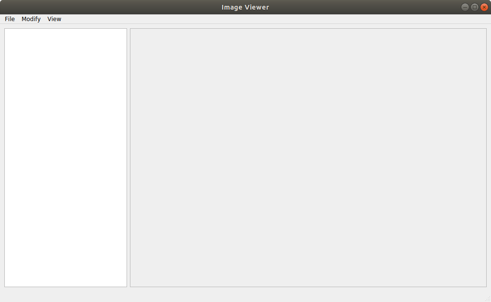
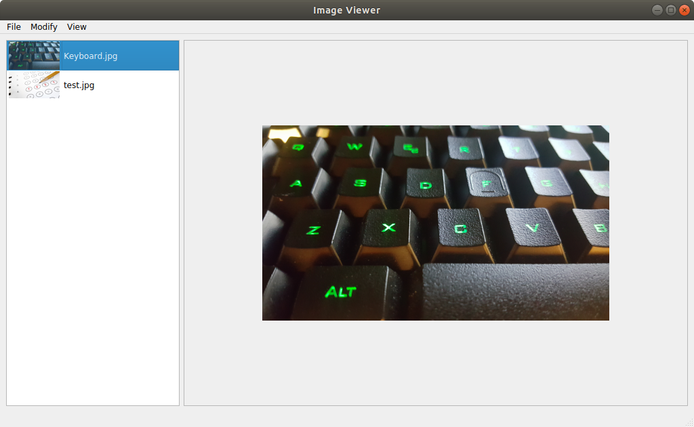
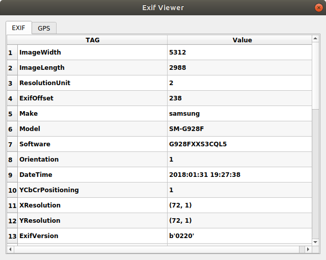
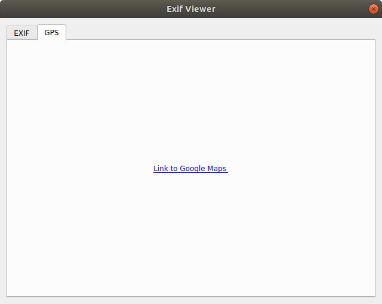

# ImageViewer
This project is a simple image viewer developed for an exam at [Università degli Studi di Firenze](https://www.ingegneria.unifi.it/index.php).

## Requirements
| Software  | Version | 
|:--------------------------------------------------------------:|:-------:|
| [Python](https://www.python.org)                               | 3.6     |
| [Pillow](http://pillow.readthedocs.io/en/latest/index.html)    | 5.0.0   |
| [PyQt5](https://pypi.python.org/pypi/PyQt5)                    | 5.10    |

## Launch the applications
In order to launch the image viewer is sufficient to wirte on terminal:
```
python3 image_viewer.py
```

## Usage
* To **load** an image (or multiple images) click on *File -> Open* (shortcut CTRL+O)
* To **show an image** *double click* on image thumbnail
* To **rotate** an open image click on *Modify -> Rotate -> 90° clockwise (or 90° counterclockwise)* (CTRL+R or CTRL+A)
* To **show the EXIF tags** select an image from the list and click on *View -> Exif* (shortcut CTRL+E)

## Preview




